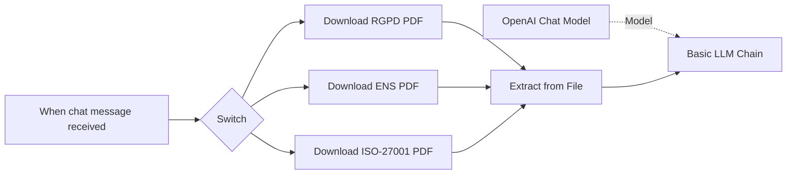

# Ex-1213-TFC-Asistente-ciberseguridad-y-compliance
Asistente de IA en n8n para automatizar la comparación de políticas de seguridad empresariales con ISO 27001, GDPR y normativa del BOE.

## Arquitectura del sistema

Este proyecto implementa un asistente de consulta normativa mediante n8n, utilizando documentos de referencia almacenados en Google Drive y un modelo de lenguaje de OpenAI para responder preguntas sobre distintas normativas de ciberseguridad y protección de datos.

## Componentes principales
- n8n: plataforma de automatización que orquesta el flujo de trabajo.
- Google Drive: repositorio donde se almacenan los documentos normativos.
- Extract from File: componente encargado de extraer el contenido textual de los archivos PDF.
- OpenAI Chat Model: modelo de lenguaje utilizado para procesar la información y generar respuestas.
- Chat Interface: punto de entrada para las consultas de los usuarios.

```text
  Usuario
   │
   ▼
Chat n8n
   │
   ▼
Workflow de consulta
   │
   ├── RGPD.pdf
   ├── ENS.pdf
   └── ISO27001.pdf
         │
         ▼
 Extracción de texto
         │
         ▼
 OpenAI Chat Model
         │
         ▼
 Respuesta al usuario
```

## Diagrama de flujo


