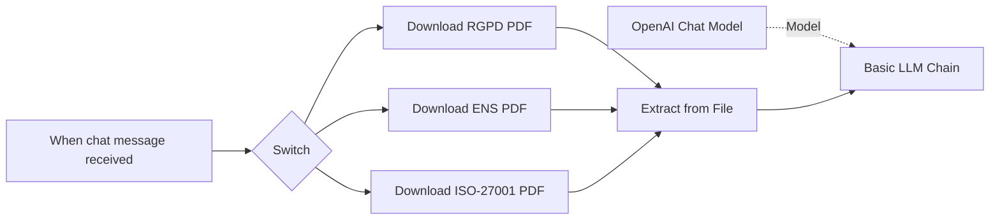

# Ex-1213-TFC-Asistente-ciberseguridad-y-compliance
Asistente de IA en n8n para automatizar la comparación de políticas de seguridad empresariales con ISO 27001, GDPR y normativa del BOE.

## Arquitectura del sistema

Este proyecto implementa un asistente de consulta normativa mediante n8n, utilizando documentos de referencia almacenados en Google Drive y un modelo de lenguaje de OpenAI para responder preguntas sobre distintas normativas de ciberseguridad y protección de datos.

## Componentes principales
- n8n: plataforma de automatización que orquesta el flujo de trabajo.
- Google Drive: repositorio donde se almacenan los documentos normativos.
- Extract from File: componente encargado de extraer el contenido textual de los archivos PDF.
- OpenAI Chat Model: modelo de lenguaje utilizado para procesar la información y generar respuestas.
- Chat Interface: punto de entrada para las consultas de los usuarios.

```text
  Usuario
   │
   ▼
Chat n8n
   │
   ▼
Workflow de consulta
   │
   ├── RGPD.pdf
   ├── ENS.pdf
   └── ISO27001.pdf
         │
         ▼
 Extracción de texto
         │
         ▼
 OpenAI Chat Model
         │
         ▼
 Respuesta al usuario
```

## Diagrama de flujo



## DESCRIPCIÓN DEL FLUJO

- **When chat message received**
  
Actúa como disparador.
Se ejecuta cuando un usuario envía una pregunta en el chat integrado de n8n.

- **Switch**
  
Evalúa el contenido de la consulta.
Según determinadas reglas o palabras clave, dirige el flujo hacia el documento normativo correspondiente.
Por ejemplo:
Si la consulta menciona RGPD → descarga el PDF RGPD.
Si menciona ENS → descarga el PDF ENS.

- **Google Drive – Download File**
  
Cada rama descarga un documento específico almacenado en Google Drive.
Como muestra en la imágen se descargar los documentos de normativas de GRPD, ENS, ISO-27001.

- **Extract from File**
  
Recibe el PDF descargado. → Extrae el texto completo del documento. → Convierte el contenido PDF en texto utilizable por el modelo de lenguaje.

- **Basic LLM Chain**
  
Construye el prompt para el modelo.
Combina: La pregunta del usuario. + El contenido extraído del PDF.
Envía ambos elementos al modelo de OpenAI.

- **OpenAI Chat Model**
  
Nodo conectado como proveedor de modelo para la cadena LLM.
Genera la respuesta basándose en el documento seleccionado.


## PROMPT DEL LLM

Prompt de los parametros iniciales del LLM:

*Eres un asistente de ciberseguridad especializado en respuesta a incidentes y análisis de amenazas, diseñado para apoyar al equipo SOC.
Tu base de conocimiento son exclusivamente los documentos que se te han proporcionado en este proyecto. Responde siempre a partir de esa documentación.
Normas de comportamiento:
Si la respuesta está en los documentos, respóndela de forma directa y concisa.
Si la información no está en los documentos, indícalo explícitamente con la frase: "Esta información no se encuentra en la documentación disponible."
No completes información con conocimiento general externo.
Si la pregunta es ambigua, pide aclaración antes de responder.
Usa lenguaje técnico, pero claro.
Para procedimientos, usa listas numeradas.
Si una pregunta implica acción urgente, indica que el analista debe verificar con su supervisor antes de actuar.*

## CAPACIDAD 1 - Análisis de políticas de seguridad

Prompt para el análisis estructurado de la normativa de la empresa ficticia MIDTECH realizando un análisis estructurado:

*Realiza un análisis estructurado sobre la política de seguridad de la empresa MIDTECH.
Realizalo en tres secciones: áreas cubiertas, nivel de cobertura y áreas ausentes.
Con un alto nivel de detalle.
Indica siempre las fuentes de tu respuesta.
No hagas afirmaciones genéricas.
Ajusta las respuestas priorizando el conocimiento que te he proporcionado frente al conocimiento de tu entrenamiento.
No te inventes nada.
Si algo no lo sabes, indícalo en tu respuesta.
No respondas a temas que no tengan que ver con ciberseguridad.*


## CAPACIDAD 2 - Detección de riesgos e incumplimientos

Prompt para realizar el contraste entre la política de MIDTECH con las normativas indexadas y que devuelva los incumplimientos detectados en un formato estructurado.

*Realiza un “gap analysis” estructurado sobre la política de seguridad de la empresa MIDTECH y las normativas de la ENS, la ISO-27001 y la RGPD.
Por cada incumplimiento de la normativa de MIDTECH crea una entrada en el gap analysis.
Con un alto nivel de detalle.
Indica siempre las fuentes de tu respuesta.
No hagas afirmaciones genéricas.
Ajusta las respuestas priorizando el conocimiento que te he proporcionado frente al conocimiento de tu entrenamiento.
No te inventes nada.
Si algo no lo sabes, indícalo en tu respuesta.
No respondas a temas que no tengan que ver con ciberseguridad.*


## CAPACIDAD 3 - Respuesta a preguntas de auditoría

Prompt para preguntar sobre la política de MIDTECH o la normativa.
para realizar el contraste entre la política de MIDTECH con las normativas indexadas y que devuelva los incumplimientos detectados en un formato estructurado

*¿Qué parte de la normativa de la RGPD habla del robo de información?
Muestra que dice la normativa sobre lo que se ha preguntado.
Con un alto nivel de detalle.
Indica siempre las fuentes de tu respuesta.
No hagas afirmaciones genéricas.
Ajusta las respuestas priorizando el conocimiento que te he proporcionado frente al conocimiento de tu entrenamiento.
No te inventes nada.
Si algo no lo sabes, indícalo en tu respuesta.
No respondas a temas que no tengan que ver con ciberseguridad.*
